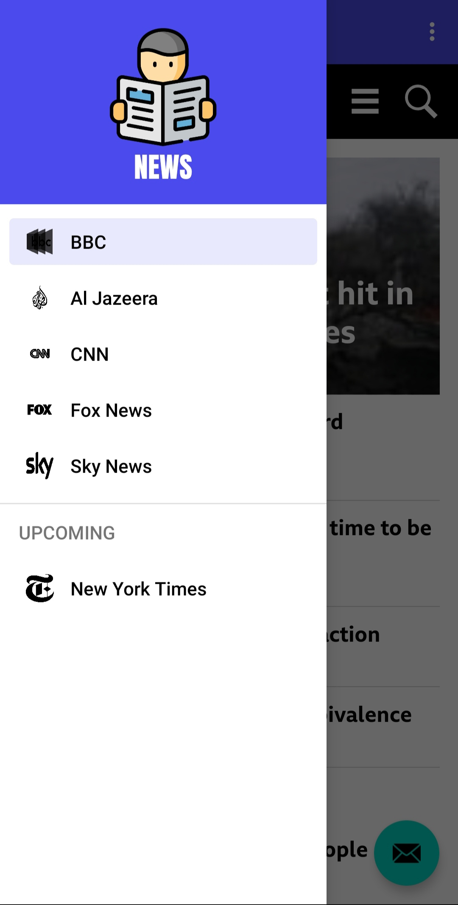
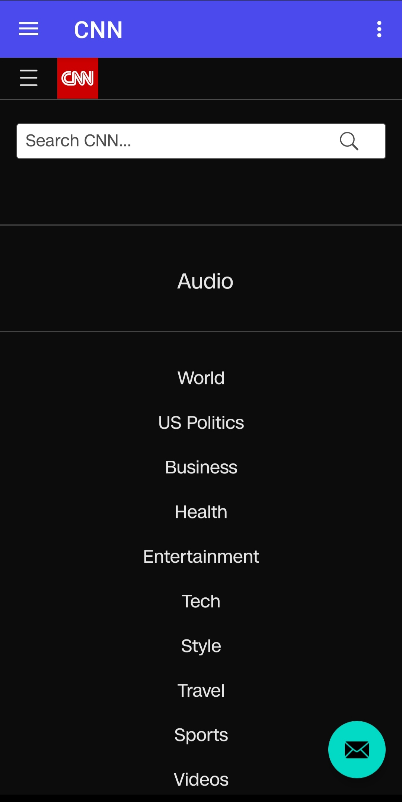
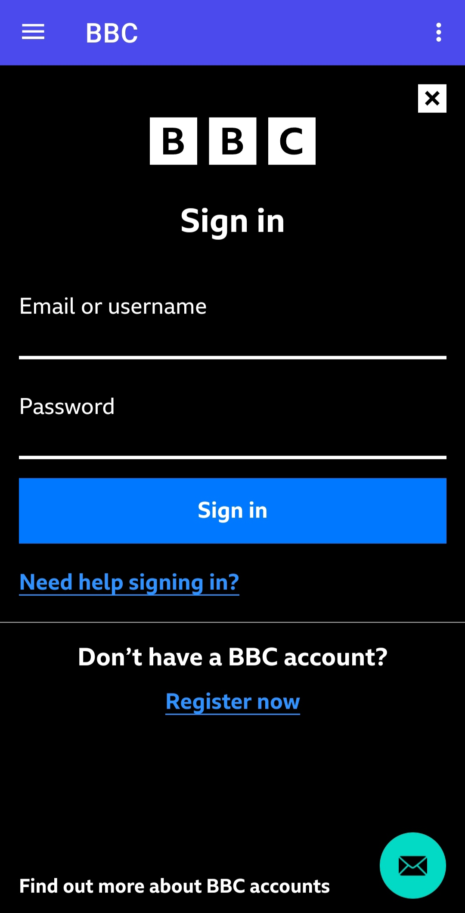

# News App

## 🌟 About

* This is a news application made in Java using Android Studio.
* This application displays news from 5 popular news channels without using any web browser.
* More news channels can also be added.
* It has a feature of navigation drawer.
* Fragments feature is used in the application.
* Material designs are also used.

## ✨ Screenshots

<div style="display:flex;">



</div>
<br>
<div style="display:flex;">



</div>


## 🌟 Prerequisites
*   Android Studio 
*   Java JDK

## 🔨 Build and Run Application

Follow this steps to get Working Project!
```
1. Clone this repository or download file
2. Extract zip if downloaded code
3. Open project in Android Studio
4. Wait while Android Studio Download gradle or required files
5. Hit Run Button !
```

## 🤝 How to Contribute
```
1. Fork it
2. Create your feature branch (git checkout -b my-new-feature)
3. Commit your changes (git commit -am 'Add some feature')
4. Push to the branch (git push origin my-new-feature)
5. Create new Pull Request
```
